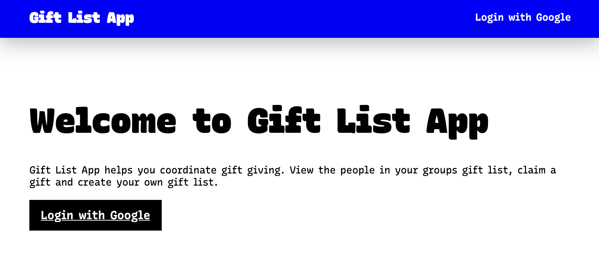
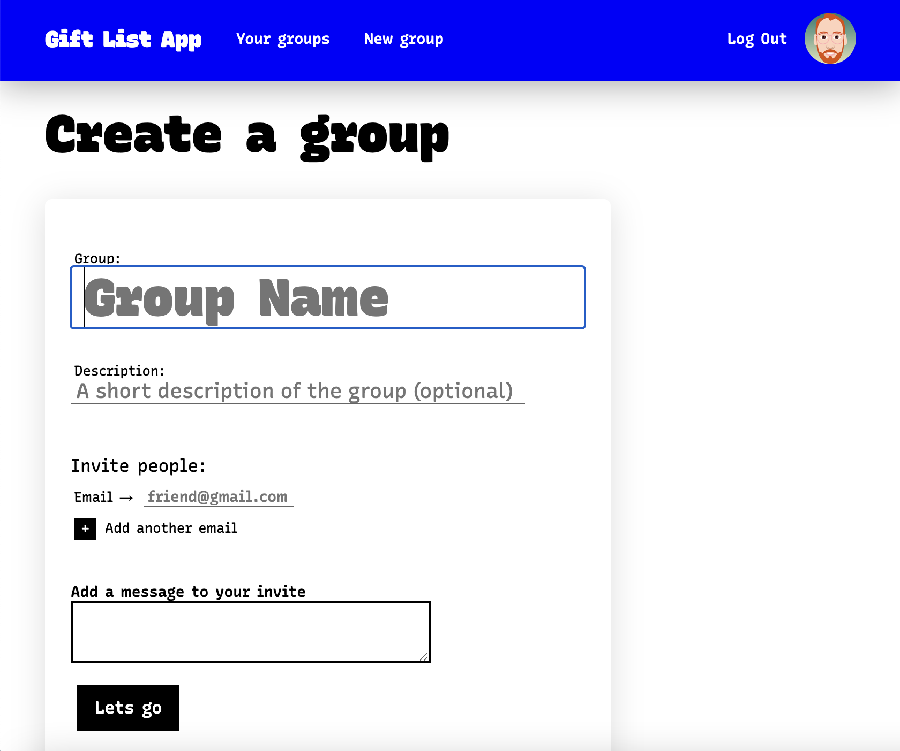
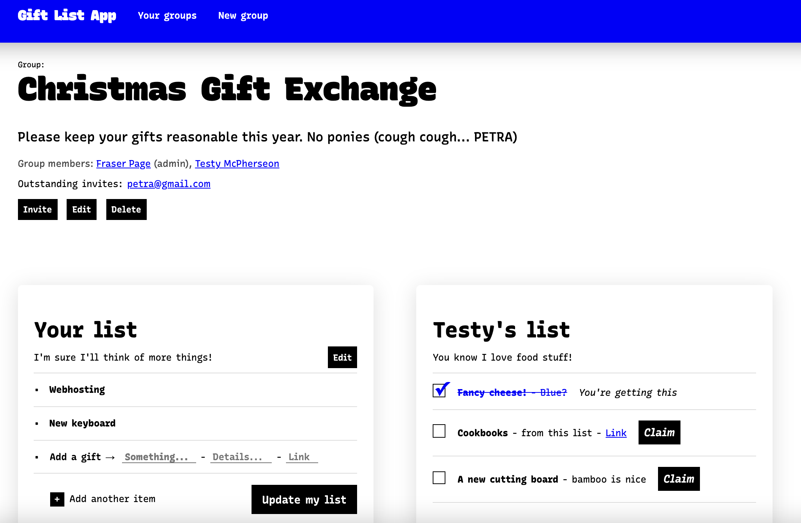

# gift-list-app
An app that solves the problem of communicating and coordinating gifts

## Use the app
* [Open the app on Heroku](https://giftlists-app.herokuapp.com/)

## Screenshots

## Technologies Used
* Express/Node
* Mongo/Mongoose
* Running on Heroku and MongoDB Atlas
* EJS templating
* Nodemailer with Sendgrid for emails
* CSS Variables to take full advantage of [Recursive Sans](https://www.recursive.design/), the very cool variable font the site uses.

## Next Steps
* AJAXify form submission - especially adding gifts to a list
* Update and Delete on list items
* Allow un-claiming a gift
* Add opt-in notifications for updates to gift lists
* Add a question and answer feature for gifts to allow users to communicate about individual gifts

## Planning/Dev
* [ERD](https://lucid.app/lucidchart/285fbeb7-c562-41ac-862c-5b7ce53f4e46/view?page=0_0#) ([Edit link](https://lucid.app/lucidchart/285fbeb7-c562-41ac-862c-5b7ce53f4e46/edit?beaconFlowId=35D28D8593A7476E&page=0_0#))
* [Trello](https://trello.com/b/R3abJ3Ku/gift-app-development)
* [Wireframes](https://www.figma.com/file/Es42EQCISeqIXTWqvnghQp/Gift-app?node-id=0%3A1)

